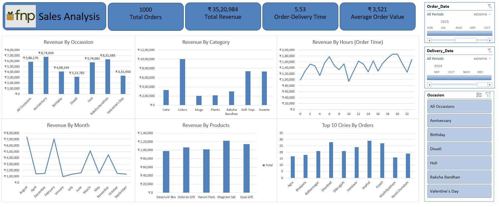

# FNP Sales Analysis Dashboard

## Project Overview

This project analyzes FNP sales data to identify key revenue drivers, customer purchasing patterns, seasonal trends, product performance, geographic demand, and delivery efficiency.

The dashboard was built in Microsoft Excel using Power Query, Power Pivot, PivotTables, calculated measures, slicers, timelines, and interactive charts to transform raw sales data into business insights.

## Dashboard Preview

## Key KPIs

| KPI | Value |
|---|---:|
| Total Orders | 1,000 |
| Total Revenue | ₹35,20,984 |
| Average Order Value | ₹3,521 |
| Average Order-to-Delivery Time | 5.53 days |
| Quantity vs Delivery-Time Correlation | 0.00348 |

## Tools & Techniques

- Microsoft Excel
- Power Query
- Power Pivot
- PivotTables
- PivotTable Analyze
- Calculated Measures
- Slicers
- Timeline Filters
- Interactive Charts
- KPI Analysis
- Correlation Analysis
- Data Cleaning & Transformation
- Business Insight Generation

## Business Questions Answered

- Which occasions generate the highest revenue?
- Which product categories perform best?
- Which products contribute the most revenue?
- Which months show the strongest sales performance?
- At what time of day is revenue highest?
- Which cities generate the most orders?
- What is the average order-to-delivery time?
- Does order quantity have any relationship with delivery time?

## Key Insights

- **Anniversary** generated the highest revenue at approximately **₹6.75 lakh**.
- **Raksha Bandhan** and **Holi** were also major revenue contributors.
- **Colors** was the highest-performing product category at approximately **₹10 lakh**.
- **Magnam Set** was the strongest-performing product among the products analyzed.
- Revenue showed clear seasonal variation, with **August and February** among the strongest months.
- Revenue activity was strongest during the **evening hours, particularly around 7 PM–8 PM**.
- **Imphal** recorded the highest number of orders among the cities displayed.
- Average order-to-delivery time was approximately **5.53 days**.
- The correlation between **quantity ordered and delivery duration was 0.00348**, indicating virtually no linear relationship between the two variables.

## Business Recommendations

- Focus marketing efforts around high-performing occasions such as Anniversary, Raksha Bandhan, and Holi.
- Increase visibility of strong categories and best-selling gift sets.
- Prepare inventory and campaigns ahead of peak sales months.
- Test promotional campaigns during high-activity evening hours.
- Use city-level insights for regional marketing strategies.
- Investigate factors such as location, product type, availability, and seasonality to better understand delivery performance.

## Detailed Executive Summary

For a deeper explanation of the analysis, business interpretation, correlation findings, and recommendations, see:

**[Executive_Summary.md](Executive_Summary.md)**

## Conclusion

The analysis shows that FNP sales are strongly influenced by occasion-based demand, product mix, seasonality, customer ordering time, and geography.

The project demonstrates how Excel can be used not only for reporting, but also for data transformation, modeling, KPI development, interactive dashboarding, and business decision support.

## Project Brief

The original business requirements and analysis questions are available here:

[View Problem Statement](FNP_Sales_Analysis_Problem_Statement.pdf)
